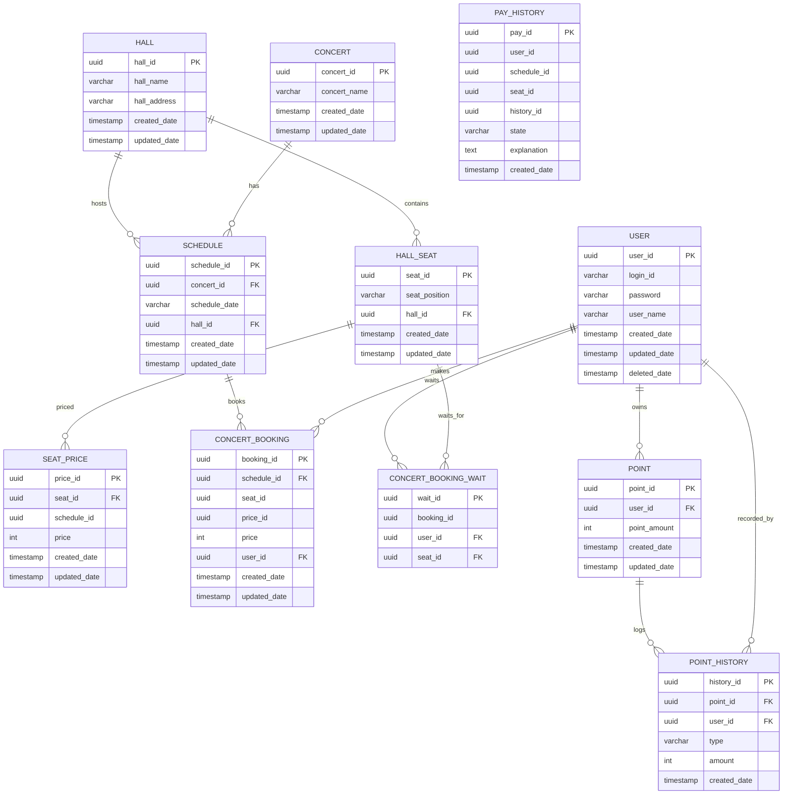

# 🎫 콘서트 예약 서비스 - DB & ERD

### ✅ 체크리스트

* [ ] 테이블 관계가 도메인과 일치(예약/좌석/결제/잔액/사용자)
* [ ] FK/제약/인덱스/유니크키/체크로 무결성·성능 보장
* [ ] 트랜잭션 경계/격리수준 정의, 락 전략(row lock/Optimistic version)
* [ ] 롤백 플랜

# 🔎 모델링 포인트 & 도메인 엔터티 상세

## 핵심 모델링 원칙

* **SEAT(좌석)는 영구 상태만 유지**: `AVAILABLE` / `SOLD`
* **임시배정(홀드)은 `CONCERT_BOOKING(HELD)` + `hold_expires_at`로 표현**
* **시간축 이력**: 하나의 좌석은 시간 경과에 따라 여러 `CONCERT_BOOKING`과 연결될 수 있음(1:N)
* **활성 예약만 중복 금지**: `UNIQUE(schedule_id, seat_id) WHERE status IN ('HELD','CONFIRMED')`
* **Idempotency 보장**: `PAY_HISTORY(user_id, idempotency_key)` / `POINT_HISTORY(user_id, idempotency_key)` 유니크

---
## 📊 시스템 개요

| 구분        | 값                                                        |
| --------- | -------------------------------------------------------- |
| 전체 Entity | **11개**                                                  |
| 도메인       | **6개** (대기열, 사용자, 카탈로그(날짜/좌석), 예약, 결제, 포인트)            |
| 관계(주요)    | **12개 내외**                                               |
| 좌석 범위     | 1–50번 (좌석 포지션 정의 시)                                      |
| 핵심 제약     | 좌석 중복 방지, Idempotency 보장, TTL 만료, Row-level Lock         |
| 동시성 제어    | Redis Lua(SETNX+TTL), DB 트랜잭션(SELECT…FOR UPDATE), 낙관적 버전 |
| 확장성       | 활성 슬롯 N, 배치 승격(초당 M명), 멀티 AZ/오토스케일                       |

---
### 확장 요약

* **도메인**

    * 대기열(Queue): 토큰 발급/승격/만료, 활성 슬롯 제어
    * 사용자(User): 식별/인증, 권한
    * 카탈로그(Catalog): 예약 가능 **날짜/좌석** 공개
    * 예약(Reservation): 좌석 **홀드(HELD)**와 만료, 최종 확정(BOOKED)
    * 결제(Payment): 멱등 결제, 내역 추적
    * 포인트(Point): 충전/차감, 음수 방지

* **주요 엔터티(예)**

    * `user`, `point`, `point_history`, `concert`, `schedule`, `hall`, `hall_seat`, `seat_price`, `concert_booking`, `concert_booking_wait`, `pay_history`

* **대표 관계**

    * User 1–N Booking, Schedule 1–N Booking, Hall 1–N Seat, Seat 1–N Price 등

* **운영 상수 & 정책**

    * **홀드 TTL**: 기본 5분 (테스트 환경 2초)
    * **활성 슬롯 N**: 동시 활성 유저 수 제한(예: 1,000)
    * **승격 주기**: 초당 M명(예: 100/s) 배치 승격

---
## ERD

---
## index/query 계획 표

| 테이블      | 핵심 쿼리                         | 인덱스                                              | 기대 효과    |
| -------- | ----------------------------- | ------------------------------------------------- | -------- |
| concert_booking | schedule+seat 조회/잠금            | (schedule_id, seat_id) UNIQUE (활성 상태 조건)        | 경합 최소화   |
| pay_history     | Idempotency 검사               | (user_id, idempotency_key) UNIQUE                 | 중복 결제 방지 |
| point_history   | Idempotency 검사               | (user_id, idempotency_key) UNIQUE                 | 중복 차감 방지 |


## 🏗️ 도메인별 Entity 상세

### 🎵 공연장/콘서트 도메인

**HALL**

| 필드                        | 타입       | 설명                          |
| ------------------------- | -------- | --------------------------- |
| hall_id (PK)              | UUID     | 공연장 ID                      |
| hall_name                 | String   | 공연장명                        |
| hall_address              | String   | 주소                          |
| created_date / updated_date | DateTime | 생성/수정                       |

**HALL_SEAT**

| 필드                        | 타입       | 설명                |
| ------------------------- | -------- | ----------------- |
| seat_id (PK)              | UUID     | 좌석 ID             |
| seat_position             | String   | 좌석 위치(구역/열/번호) |
| hall_id (FK)              | UUID     | 공연장 ID           |
| created_date / updated_date | DateTime | 생성/수정            |

> 제약: **Unique(hall_id, seat_position)** – 공연장 내 좌석 고유

**CONCERT**

| 필드                        | 타입       | 설명         |
| ------------------------- | -------- | ---------- |
| concert_id (PK)           | UUID     | 콘서트 ID     |
| concert_name              | String   | 콘서트명       |
| created_date / updated_date | DateTime | 생성/수정      |

**SCHEDULE**

| 필드                        | 타입       | 설명     |
| ------------------------- | -------- | ------ |
| schedule_id (PK)          | UUID     | 스케줄 ID |
| concert_id (FK)           | UUID     | 콘서트 ID |
| schedule_date             | String   | 공연 일시 |
| hall_id (FK)              | UUID     | 공연장 ID |
| created_date / updated_date | DateTime | 생성/수정  |

**SEAT_PRICE**

| 필드                        | 타입       | 설명        |
| ------------------------- | -------- | --------- |
| price_id (PK)             | UUID     | 가격 ID     |
| seat_id (FK)              | UUID     | 좌석 ID     |
| schedule_id               | UUID     | 스케줄 ID   |
| price                     | Int      | 가격        |
| created_date / updated_date | DateTime | 생성/수정     |

---

### 👤 사용자/대기열 도메인

**USER**

| 필드                        | 타입       | 설명             |
| ------------------------- | -------- | -------------- |
| user_id (PK)              | UUID     | 사용자 ID         |
| login_id                  | String   | 로그인 ID(Unique) |
| password                  | String   | 비밀번호          |
| user_name                 | String   | 이름             |
| created_date / updated_date | DateTime | 생성/수정          |
| deleted_date              | DateTime | 삭제 시각         |

**CONCERT_BOOKING_WAIT**

| 필드                        | 타입       | 설명         |
| ------------------------- | -------- | ---------- |
| wait_id (PK)              | UUID     | 대기 ID      |
| booking_id                | UUID     | 예약 ID      |
| user_id (FK)              | UUID     | 사용자 ID    |
| seat_id (FK)              | UUID     | 좌석 ID      |

---

### 📋 예약 도메인

**CONCERT_BOOKING**

| 필드                        | 타입       | 설명                                            |
| ------------------------- | -------- | --------------------------------------------- |
| booking_id (PK)           | UUID     | 예약 ID                                         |
| user_id (FK)              | UUID     | 사용자                                           |
| schedule_id (FK)          | UUID     | 회차                                            |
| seat_id                   | UUID     | 좌석 ID                                         |
| price_id                  | UUID     | 가격 ID                                         |
| price                     | Int      | 결제 예정 금액                                      |
| status                    | Enum     | `HELD` / `CONFIRMED` / `CANCELED` / `EXPIRED` |
| hold_expires_at           | DateTime | 임시배정 만료                                       |
| created_date / updated_date | DateTime | 생성/수정                                         |

> 제약(Partial Unique): `UNIQUE(schedule_id, seat_id) WHERE status IN ('HELD','CONFIRMED')`

---

### 💳 결제/포인트 도메인

**PAY_HISTORY**

| 필드                        | 타입       | 설명                    |
| ------------------------- | -------- | --------------------- |
| pay_id (PK)               | UUID     | 결제 ID                 |
| user_id                   | UUID     | 사용자                   |
| schedule_id               | UUID     | 회차                    |
| seat_id                   | UUID     | 좌석                    |
| history_id                | UUID     | 포인트 이력 ID           |
| state                     | Enum     | `SUCCESS` / `FAILED`  |
| explanation               | Text     | 실패 사유/메모            |
| created_date              | DateTime | 생성                    |
| idempotency_key           | String   | 멱등 키(Unique by user) |

> 제약: `Unique(user_id, idempotency_key)` – Idempotency 보장

**POINT**

| 필드                        | 타입       | 설명       |
| ------------------------- | -------- | -------- |
| point_id (PK)             | UUID     | 포인트 ID  |
| user_id (FK)              | UUID     | 사용자     |
| point_amount              | Int      | 잔액       |
| created_date / updated_date | DateTime | 생성/수정    |

**POINT_HISTORY**

| 필드                        | 타입       | 설명                                              |
| ------------------------- | -------- | ----------------------------------------------- |
| history_id (PK)           | UUID     | 이력 ID                                           |
| point_id (FK)             | UUID     | 포인트 ID                                         |
| user_id (FK)              | UUID     | 사용자                                             |
| type                      | Enum     | `CHARGE` / `DEBIT` / `REFUND` / `ADJUST`        |
| amount                    | Int      | 금액                                              |
| created_date              | DateTime | 생성                                              |
| idempotency_key           | String   | 멱등 키(Unique by user)                             |

> 제약: `Unique(user_id, idempotency_key)` – Idempotency 보장

---

## 🔗 핵심 관계/제약 요약

| 관계                                    | 카디널리티 | 비고              |
| ------------------------------------- | ----- | --------------- |
| HALL → HALL_SEAT                       | 1:N   | 공연장-좌석          |
| CONCERT → SCHEDULE                     | 1:N   | 콘서트-회차          |
| HALL → SCHEDULE                        | 1:N   | 공연장-회차          |
| SCHEDULE → SEAT_PRICE                  | 1:N   | 회차-가격            |
| SCHEDULE → CONCERT_BOOKING             | 1:N   | 회차-예약            |
| HALL_SEAT → CONCERT_BOOKING_WAIT       | 1:N   | 좌석-대기            |
| USER → CONCERT_BOOKING / WAIT          | 1:N   | 사용자 활동          |
| USER → POINT / POINT_HISTORY           | 1:N   | 포인트 활동          |
| POINT → POINT_HISTORY                  | 1:N   | 포인트 이력          |
| HALL_SEAT → SEAT_PRICE                 | 1:N   | 좌석 가격            |

### 부분 유니크 인덱스(권장)

```sql
-- 활성 예약만 중복 금지
CREATE UNIQUE INDEX ux_booking_active
  ON concert_booking(schedule_id, seat_id)
  WHERE status IN ('HELD','CONFIRMED');

-- 결제/포인트 멱등성 보장
CREATE UNIQUE INDEX ux_pay_history_idem ON pay_history(user_id, idempotency_key);
CREATE UNIQUE INDEX ux_point_history_idem ON point_history(user_id, idempotency_key);
```

